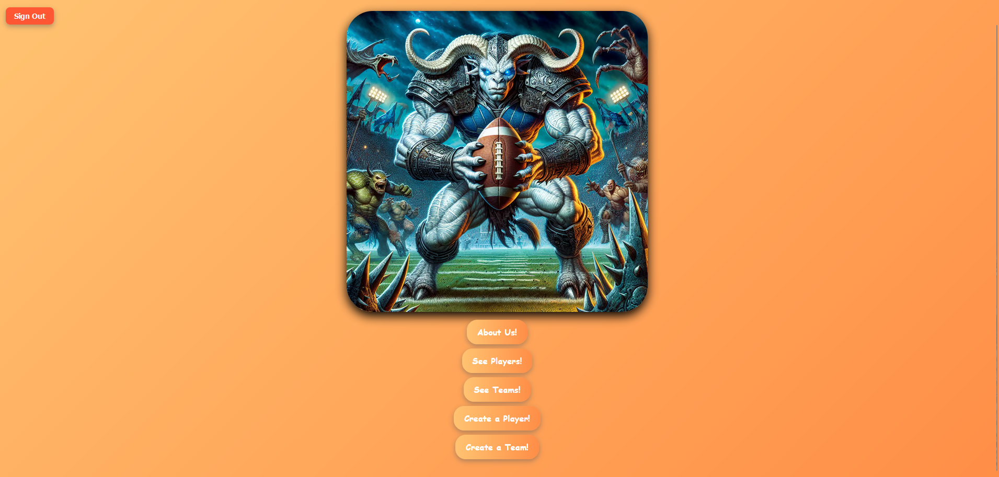

# Fantasy Sportsball!

This is a FANTASY sports team building site. This is meant to mimick the actual fantasy sports sites where users make their own teams and draft players based off of availabilty. 
No particular reason for choosing this going forward it was just a spitballed idea that we ended up going with.

## Getting Started
- Deployed site = https://fantasy-sportsball.netlify.app/
- Planning materials = https://trello.com/b/iWgYjDcm/project-3-mern-stack
- Backend repo = https://github.com/CinqueaS/Fantasy-Sport-Mockup-backend

## Technologies Used
- React
- Javascript
- Mongoose
- Node
- Express

## Next Steps
- Implementing Mock matches between teams
- Changing player stats based off of mock matches